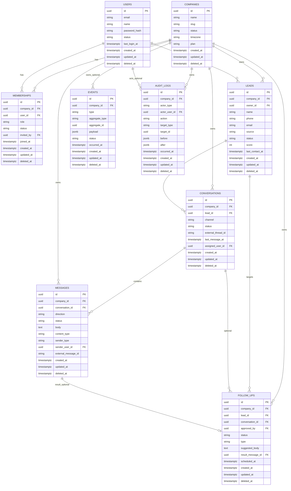

# ERD Textual — AutoPilot MVP

**Status:** Proposta (espelha `database-model.md`)  
**Formato:** ASCII + Mermaid  
**Sem schema Prisma / migrations nesta etapa.**

---

## 1. Diagrama ASCII

```text
┌──────────────────────┐         ┌──────────────────────┐
│       users          │         │      companies       │
│──────────────────────│         │──────────────────────│
│ id PK                │         │ id PK                │
│ email UK*            │         │ name                 │
│ name                 │         │ slug UK*             │
│ password_hash?       │         │ status               │
│ status               │         │ timezone             │
│ last_login_at?       │         │ plan?                │
│ created_at           │         │ created_at           │
│ updated_at           │         │ updated_at           │
│ deleted_at?          │         │ deleted_at?          │
└──────────▲───────────┘         └──────────▲───────────┘
           │                                 │
           │         ┌───────────────────────┤
           │         │                       │
           │  ┌──────┴───────────────┐       │
           └──┤    memberships       │───────┘
              │──────────────────────│
              │ id PK                │
              │ company_id FK        │
              │ user_id FK           │
              │ role (OWNER|ADMIN|   │
              │       AGENT)         │
              │ status               │
              │ invited_by? FK       │
              │ joined_at?           │
              │ created_at           │
              │ updated_at           │
              │ deleted_at?          │
              │ UK*(company_id,      │
              │     user_id)         │
              └──────────────────────┘


┌──────────────────────┐
│        leads         │
│──────────────────────│
│ id PK                │
│ company_id FK ───────┼──► companies
│ owner_id? FK ────────┼──► users
│ name?                │
│ phone  UK*(company,  │
│        phone)        │
│ email?               │
│ source               │
│ status (NEW|…|LOST)  │
│ score (0..100)       │
│ last_contact_at?     │
│ last_inbound_at?     │
│ last_outbound_at?    │
│ external_id?         │
│ metadata?            │
│ created_at           │
│ updated_at           │
│ deleted_at?          │
└──────────▲───────────┘
           │
           │ 1:N
           │
┌──────────┴───────────┐
│    conversations     │
│──────────────────────│
│ id PK                │
│ company_id FK ───────┼──► companies
│ lead_id FK           │
│ channel (WHATSAPP)   │
│ status               │
│ external_thread_id?  │
│ last_message_at?     │
│ assigned_user_id? FK─┼──► users
│ created_at           │
│ updated_at           │
│ deleted_at?          │
└──────────▲───────────┘
           │
           │ 1:N  (obrigatório — Message ⊂ Conversation)
           │
┌──────────┴───────────┐
│      messages        │
│──────────────────────│
│ id PK                │
│ company_id FK ───────┼──► companies
│ conversation_id FK   │  NOT NULL
│ direction            │
│ status               │
│ body?                │
│ content_type         │
│ sender_type          │
│ sender_user_id? FK ──┼──► users
│ external_message_id? │  UK*(company, external_message_id)
│ sent_at?             │
│ delivered_at?        │
│ read_at?             │
│ metadata?            │
│ created_at           │
│ updated_at           │
│ deleted_at?          │
└──────────▲───────────┘
           │
           │ 0..1 (result_message)
           │
┌──────────┴───────────┐
│     follow_ups       │
│──────────────────────│
│ id PK                │
│ company_id FK ───────┼──► companies
│ lead_id FK ──────────┼──► leads
│ conversation_id? FK ─┼──► conversations
│ assigned_user_id? FK─┼──► users
│ approved_by? FK ─────┼──► users
│ approved_at?         │
│ channel              │
│ status (híbrido D3)  │
│ type                 │
│ scheduled_at?        │
│ executed_at?         │
│ suggested_body?      │
│ result_message_id? FK┼──► messages
│ cancel_reason?       │
│ created_at           │
│ updated_at           │
│ deleted_at?          │
└──────────────────────┘


┌──────────────────────┐       ┌──────────────────────┐
│       events         │       │     audit_logs       │
│──────────────────────│       │──────────────────────│
│ id PK                │       │ id PK                │
│ company_id? FK ──────┼──►    │ company_id FK ───────┼──► companies
│ type                 │ co.   │ actor_type           │
│ aggregate_type       │       │ actor_user_id? FK ───┼──► users
│ aggregate_id         │       │ action               │
│ payload              │       │ target_type          │
│ actor_user_id? FK ───┼──►u   │ target_id            │
│ correlation_id?      │       │ before? / after?     │
│ occurred_at          │       │ ip? / user_agent?    │
│ status               │       │ occurred_at          │
│ created_at           │       │ created_at           │
│ updated_at           │       │ updated_at           │
│ deleted_at?          │       │ deleted_at?          │
└──────────────────────┘       └──────────────────────┘

UK* = unique parcial WHERE deleted_at IS NULL
```

---

## 2. Diagrama Mermaid



---

## 3. Cardinalidades-chave

| Relação | Cardinalidade | Regra |
|---|---|---|
| User ↔ Company | N:N via Membership | Membership obrigatória para acesso |
| Company → Lead | 1:N | phone único por company |
| Lead → Conversation | 1:N | |
| Conversation → Message | 1:N | Message nunca órfã |
| Lead → FollowUp | 1:N | híbrido: approve antes de send |
| FollowUp → Message | 0..1 | resultado do envio |

---

## 4. Fora do ERD (MVP)

- `recovery_campaigns`
- `lead_scores` (score vive em `leads.score`)
- entidades de ERP / oficina / veículos / financeiro

---

## 5. Próximo passo

Após aprovação de `database-model.md` + este ERD:

→ gerar `prisma/schema.prisma` e migration inicial (**somente com autorização explícita**).
