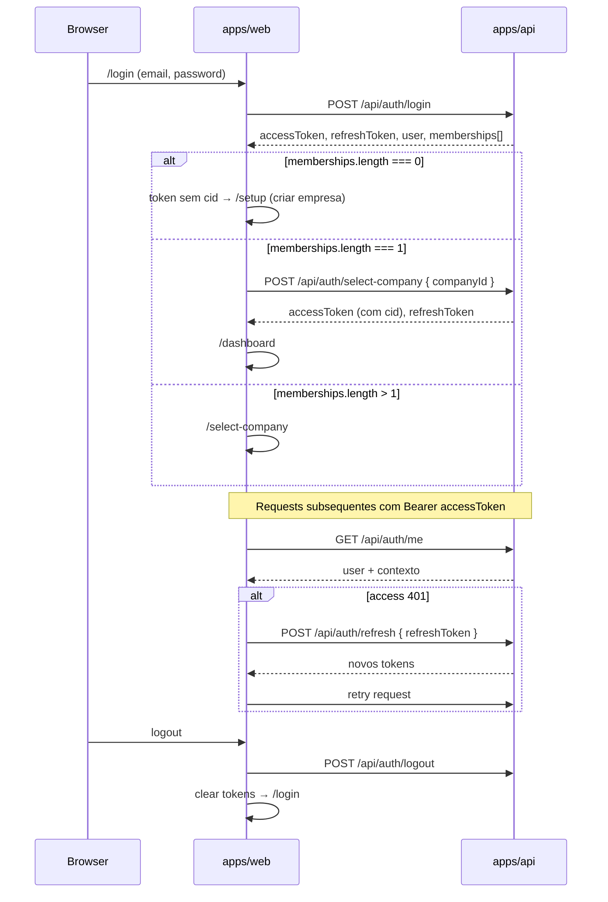

# Autopilot CRM — Arquitetura Frontend SaaS

**Versão:** 1.0  
**Stack alvo:** Next.js 15 (App Router) + TypeScript  
**App:** `apps/web`  
**Backend auditado:** `apps/api` (NestJS, prefixo global `/api`)  
**Data:** 2026-08-04  
**Escopo:** especificação de arquitetura apenas — sem implementação de código.

---

## 0. Premissas e contratos com a API

### 0.1 Base URL e prefixos

| Superfície | Prefixo | Auth |
|------------|---------|------|
| API de negócio | `/api/*` | JWT Bearer (exceto auth login/refresh e webhooks) |
| Health | `/health`, `/health/live`, `/health/ready` | público |
| Métricas | `/metrics` | público (Prometheus) — **não expor no SaaS cliente** |

Base URL do browser: variável `NEXT_PUBLIC_API_URL` (ex.: `https://api.exemplo.com`).

### 0.2 Autenticação HTTP

- Header: `Authorization: Bearer <accessToken>`
- Cookie HttpOnly opcional para refresh (se o backend emitir cookie no login/refresh); o frontend deve espelhar o contrato real do login (`accessToken` + `refreshToken` no body).
- Após `POST /api/auth/select-company`, o JWT passa a incluir `cid` (companyId). **Quase todos os endpoints de negócio exigem JWT com `cid`.**
- Sem `cid`: 401/403 nos guards de empresa.

### 0.3 Roles

| Role | Escopo |
|------|--------|
| `OWNER` | Controle total da empresa |
| `ADMIN` | Administração operacional (quase igual a OWNER na API atual) |
| `AGENT` | Operação do dia a dia; sem mutações sensíveis |

Permissões detalhadas na seção 9.

### 0.4 Formatos comuns

- Datas: ISO-8601
- Moeda (`currency`): `BRL` \| `USD` \| `EUR`
- Enums de lead: `status`, `temperature`, `source` — valores do Prisma/DTO do backend
- Erros: HTTP status + body NestJS (`statusCode`, `message`, `error`); códigos de negócio úteis: `EXPORT_LIMIT_EXCEEDED`, `SETUP_COMPANY_LIMIT`, conflitos de WhatsApp, etc.
- Exportações: `Content-Type: text/csv; charset=utf-8` (stream/blob no browser)

### 0.5 Endpoints sem UI SaaS

| Endpoint | Motivo |
|----------|--------|
| `POST /api/whatsapp/webhook` | Servidor-a-servidor (Evolution); secret header |
| `GET /metrics` | Infra/ops externos |
| `/api/companies`, `/api/events` | Módulos scaffold sem rotas |

### 0.6 Estado do produto

Monorepo hoje é **API-only**. Este documento define o **primeiro frontend SaaS** (`apps/web`). Não há app mobile/admin legado a preservar.

---

## 1. Estrutura do frontend

### 1.1 Monorepo

```
apps/
  api/          # backend existente
  web/          # Next.js 15 SaaS (a criar)
docs/
  frontend-architecture.md   # este documento
```

### 1.2 Árvore sugerida `apps/web`

```
apps/web/
├── package.json
├── next.config.ts
├── tsconfig.json
├── .env.example
├── public/
│   └── brand/
├── src/
│   ├── app/                          # App Router
│   │   ├── layout.tsx                # root: fonts, providers
│   │   ├── globals.css
│   │   ├── (public)/
│   │   │   ├── layout.tsx
│   │   │   ├── page.tsx              # redirect → /login
│   │   │   ├── login/page.tsx
│   │   │   └── logout/page.tsx
│   │   ├── (auth)/
│   │   │   ├── layout.tsx            # sem shell CRM
│   │   │   └── select-company/page.tsx
│   │   ├── (app)/
│   │   │   ├── layout.tsx            # AppShell (sidebar + topbar)
│   │   │   ├── page.tsx              # redirect → /dashboard
│   │   │   ├── dashboard/page.tsx
│   │   │   ├── setup/page.tsx
│   │   │   ├── leads/
│   │   │   │   ├── page.tsx
│   │   │   │   └── [leadId]/page.tsx
│   │   │   ├── conversations/
│   │   │   │   ├── page.tsx
│   │   │   │   └── [conversationId]/page.tsx
│   │   │   ├── follow-ups/page.tsx
│   │   │   ├── pipeline/page.tsx
│   │   │   ├── whatsapp/page.tsx
│   │   │   ├── ai/page.tsx
│   │   │   ├── memberships/page.tsx
│   │   │   ├── settings/page.tsx
│   │   │   ├── exports/page.tsx
│   │   │   └── ops/
│   │   │       ├── page.tsx
│   │   │       ├── diagnostics/page.tsx
│   │   │       └── audit/page.tsx
│   │   └── api/                      # BFF opcional (proxy refresh/cookies)
│   │       └── auth/[...path]/route.ts
│   ├── components/
│   │   ├── layout/
│   │   ├── auth/
│   │   ├── leads/
│   │   ├── conversations/
│   │   ├── follow-ups/
│   │   ├── pipeline/
│   │   ├── whatsapp/
│   │   ├── ai/
│   │   ├── memberships/
│   │   ├── settings/
│   │   ├── exports/
│   │   ├── ops/
│   │   ├── dashboard/
│   │   └── ui/                       # primitivos (Button, Input, Modal…)
│   ├── features/                     # lógica por domínio (hooks + mappers)
│   │   ├── auth/
│   │   ├── company/
│   │   ├── leads/
│   │   ├── conversations/
│   │   ├── follow-ups/
│   │   ├── pipeline/
│   │   ├── whatsapp/
│   │   ├── ai/
│   │   ├── memberships/
│   │   ├── settings/
│   │   ├── exports/
│   │   ├── ops/
│   │   └── dashboard/
│   ├── lib/
│   │   ├── api/
│   │   │   ├── client.ts             # fetch tipado + interceptors
│   │   │   ├── endpoints.ts          # constantes de path
│   │   │   └── types/                # DTOs espelhando OpenAPI/contratos
│   │   ├── auth/
│   │   │   ├── session.ts
│   │   │   ├── tokens.ts
│   │   │   └── permissions.ts
│   │   ├── csv.ts
│   │   └── format.ts                 # datas, moeda, telefone
│   ├── providers/
│   │   ├── auth-provider.tsx
│   │   ├── company-provider.tsx
│   │   └── query-provider.tsx        # TanStack Query
│   └── middleware.ts                 # gate de rotas (cookies/session)
```

### 1.3 Dependências recomendadas (não prescritivas de UI kit)

| Camada | Biblioteca sugerida |
|--------|---------------------|
| Framework | Next.js 15 App Router |
| Linguagem | TypeScript strict |
| Data fetching | TanStack Query v5 |
| Forms | React Hook Form + Zod |
| Estado auth/empresa | Context + cookies/local session store |
| Tabelas | TanStack Table |
| Toasts | sonner ou equivalente |
| Charts (dashboard) | Recharts ou Visx |
| Ícones | lucide-react |
| Estilo | CSS Modules ou Tailwind — **seguir design system próprio** (não bloquear arquitetura) |

### 1.4 Ambientes

| Variável | Uso |
|----------|-----|
| `NEXT_PUBLIC_API_URL` | Base da API |
| `NEXT_PUBLIC_APP_URL` | URL do SaaS (redirects) |
| Secrets de sessão | apenas server-side se usar BFF de cookies |

---

## 2. Rotas

### 2.1 Mapa de rotas (App Router)

| Rota | Grupo | Auth | `cid` | Roles | Página |
|------|-------|------|-------|-------|--------|
| `/` | public | — | — | — | Redirect `/login` ou `/dashboard` |
| `/login` | public | guest | — | — | Login |
| `/logout` | public | any | — | — | Limpa sessão → `/login` |
| `/select-company` | auth | user | opcional | any | Seleção de empresa |
| `/setup` | app | user+cid | sim | OWNER/ADMIN (criar); AGENT view-only status | Wizard onboarding |
| `/dashboard` | app | user+cid | sim | all | Dashboard |
| `/leads` | app | user+cid | sim | all | Lista de leads |
| `/leads/[leadId]` | app | user+cid | sim | all | Detalhe do lead |
| `/conversations` | app | user+cid | sim | all | Inbox |
| `/conversations/[conversationId]` | app | user+cid | sim | all | Thread |
| `/follow-ups` | app | user+cid | sim | all | Follow-ups |
| `/pipeline` | app | user+cid | sim | all | Pipeline / board |
| `/whatsapp` | app | user+cid | sim | all (mutações OWNER/ADMIN) | Conexão WhatsApp |
| `/ai` | app | user+cid | sim | all | AI Assist |
| `/memberships` | app | user+cid | sim | OWNER/ADMIN mutate; AGENT read-only ou hide | Membros |
| `/settings` | app | user+cid | sim | OWNER/ADMIN mutate; AGENT read-only | Configurações |
| `/exports` | app | user+cid | sim | OWNER/ADMIN | Exportações CSV |
| `/ops` | app | user+cid | sim | all (conteúdo por role) | Hub Ops |
| `/ops/diagnostics` | app | user+cid | sim | all (payload limited vs full) | Diagnósticos |
| `/ops/audit` | app | user+cid | sim | OWNER/ADMIN | Audit log |

### 2.2 Guards de rota (middleware + client)

1. **Guest-only** (`/login`): se há access token válido → `/select-company` ou `/dashboard`.
2. **Authenticated** (`/select-company`): access token sem exigir `cid`.
3. **Company-scoped** (`(app)/*`): access token **com** `cid`; senão → `/select-company`.
4. **Role-gated**: esconder nav + bloquear página (403 UI) para rotas `OWNER|ADMIN`.
5. **Setup gate (opcional produto):** se `GET /api/setup/status` incompleto e user é OWNER, CTA persistente; não bloquear o CRM inteiro (piloto precisa operar).

### 2.3 Deep links

- `/leads/[id]` — deep link de notificações/export
- `/conversations/[id]` — deep link de WhatsApp/inbox
- Query params úteis:
  - `/leads?status=&temperature=&q=&page=`
  - `/follow-ups?status=PENDING`
  - `/pipeline?view=board`
  - `/ops/audit?action=&from=&to=`

---

## 3. Layout principal

### 3.1 Root layout

- Providers: Query, Auth, Company, Toasts
- Fontes e tokens CSS globais
- Sem chrome de CRM

### 3.2 Public layout

- Centrado, marca Autopilot, sem sidebar
- Usado por login/logout

### 3.3 Auth layout (select-company)

- Lista de empresas / empty state para setup
- Sem navegação CRM

### 3.4 AppShell (`(app)/layout.tsx`)

```
┌──────────────────────────────────────────────────────────┐
│ Topbar: logo | company switcher | user menu | setup badge │
├────────────┬─────────────────────────────────────────────┤
│ Sidebar    │  Page header (title + primary actions)      │
│            │─────────────────────────────────────────────│
│ Dashboard  │                                             │
│ Leads      │              Main content                   │
│ Inbox      │                                             │
│ Follow-ups │                                             │
│ Pipeline   │                                             │
│ WhatsApp   │                                             │
│ AI Assist  │                                             │
│ ── admin ──│                                             │
│ Members*   │                                             │
│ Settings*  │                                             │
│ Exports*   │                                             │
│ Ops        │                                             │
└────────────┴─────────────────────────────────────────────┘
* itens condicionados por role
```

**Responsabilidades do shell:**

- Carregar `GET /api/auth/me` (user + memberships context)
- Exibir empresa ativa (do JWT/`cid` + lista local de select-company)
- Company switcher → reexecuta `select-company` + invalida queries
- Badge de setup incompleto (`GET /api/setup/status`)
- Nav filtrada por `permissions.ts`
- Mobile: sidebar drawer

**Page header padrão:** título, breadcrumb curto, slot de ações (Create Lead, Export, Connect WA…).

---

## 4. Fluxo de autenticação



### 4.1 Endpoints

| Ação | Método | Path | Body / notas |
|------|--------|------|--------------|
| Login | `POST` | `/api/auth/login` | `{ email, password }` → tokens + user + memberships |
| Select company | `POST` | `/api/auth/select-company` | `{ companyId }` → tokens com `cid` |
| Me | `GET` | `/api/auth/me` | JWT; perfil atual |
| Refresh | `POST` | `/api/auth/refresh` | `{ refreshToken }` |
| Logout | `POST` | `/api/auth/logout` | JWT |

### 4.2 Armazenamento de sessão (recomendação)

| Token | Onde | Notas |
|-------|------|-------|
| `accessToken` | memória + cookie curto **ou** sessionStorage | enviado em toda request |
| `refreshToken` | cookie HttpOnly via BFF Next **ou** localStorage (piloto) | refresh silencioso |
| `companyId` ativo | derivado do JWT (`cid`) + cache UI | não é fonte de verdade sozinho |

Para piloto: client-side tokens com refresh automático no `api/client` é aceitável; endurecer com BFF depois.

### 4.3 UX de erros

- Credenciais inválidas → mensagem no formulário
- Conta sem membership → CTA “Criar empresa” (`POST /api/setup/company`)
- Refresh falhou → logout forçado
- 403 por role → página “Sem permissão”

### 4.4 Fora de escopo atual da API

- Signup self-serve público
- Magic link / OAuth
- Convite por e-mail com aceitação (`INVITED` existe, sem delivery)

O frontend deve documentar esses gaps na UI (ex.: memberships: “convite registrado; senha provisionada offline”).

---

## 5. Fluxo de seleção de empresa

### 5.1 Quando aparece

1. Login com **2+** memberships ACTIVE (ou qualquer status usável)
2. Troca de empresa no topbar
3. Access token sem `cid` após refresh parcial / sessão incompleta
4. 401 “company context required” em qualquer tela app

### 5.2 UI `/select-company`

- Lista cards: nome da empresa, role do membership, status (`ACTIVE` / `INVITED` / …)
- Ação: selecionar → `POST /api/auth/select-company`
- Empty state:
  - Se user pode criar empresa (limite API: **máx. 1 company por user**): botão → `/setup` step company
  - Se já possui company mas token limpo: refresh memberships via re-login ou `me` se disponível

### 5.3 Troca de empresa (AppShell)

1. User escolhe outra company na lista cacheada do login/`me`
2. `POST /api/auth/select-company`
3. Substituir tokens
4. `queryClient.clear()` ou invalidate all
5. Soft navigate para `/dashboard`
6. Re-fetch `setup/status`, `whatsapp/status`, dashboard

### 5.4 Regra de negócio (API)

- `POST /api/setup/company`: no máximo **uma** empresa por usuário (`SETUP_COMPANY_LIMIT`)
- Multi-empresa no select-company = memberships em empresas de outros owners (convites), não criação ilimitada

---

## 6. Páginas e módulos

Visão consolidada dos módulos SaaS ↔ features:

| Módulo UI | Rotas | Feature folder | Primário API |
|-----------|-------|----------------|--------------|
| Auth | `/login`, `/logout` | `features/auth` | `/api/auth/*` |
| Company select | `/select-company` | `features/company` | `select-company` |
| Setup | `/setup` | `features/setup` | `/api/setup/*` |
| Dashboard | `/dashboard` | `features/dashboard` | `/api/dashboard/*` |
| Leads | `/leads`, `/leads/[id]` | `features/leads` | `/api/leads/*` |
| Conversations | `/conversations*` | `features/conversations` | `/api/conversations*`, WA send |
| Follow-ups | `/follow-ups` | `features/follow-ups` | `/api/follow-ups/*` |
| Pipeline | `/pipeline` | `features/pipeline` | `/api/pipeline`, lead status |
| WhatsApp | `/whatsapp` | `features/whatsapp` | `/api/whatsapp/*` |
| AI Assist | `/ai` | `features/ai` | `/api/ai/*` |
| Memberships | `/memberships` | `features/memberships` | `/api/memberships/*`, `/api/users/*` |
| Settings | `/settings` | `features/settings` | `/api/settings` |
| Exports | `/exports` | `features/exports` | `/api/exports/*` |
| Ops | `/ops/*` | `features/ops` | diagnostics, audit, reconcile |

Detalhamento por módulo nas seções 10–20.

---

## 7. Integração com todos os endpoints existentes

Cliente único `lib/api/client.ts`: base URL, Bearer, refresh-on-401, tipagem de erro.

### 7.1 Matriz completa API → Frontend

#### Auth — `/api/auth`

| Método | Path | UI / caller | Notas |
|--------|------|-------------|-------|
| `POST` | `/api/auth/login` | LoginPage | Persistir tokens + memberships |
| `POST` | `/api/auth/select-company` | SelectCompany, CompanySwitcher | Emite JWT com `cid` |
| `GET` | `/api/auth/me` | AuthProvider, topbar | Sessão atual |
| `POST` | `/api/auth/refresh` | api client interceptor | Silencioso |
| `POST` | `/api/auth/logout` | UserMenu, /logout | Invalidar sessão server-side |

#### Setup — `/api/setup`

| Método | Path | UI | Roles API |
|--------|------|-----|-----------|
| `POST` | `/api/setup/company` | SetupWizard step 1 | JWT (cria company + membership OWNER) |
| `GET` | `/api/setup/status` | Setup page, AppShell badge | JWT + cid; steps: `company`, `whatsapp`, `firstLead`, `firstMessage` |

#### Settings — `/api/settings`

| Método | Path | UI | Roles |
|--------|------|-----|-------|
| `GET` | `/api/settings` | SettingsPage | all |
| `PATCH` | `/api/settings` | SettingsPage form | OWNER, ADMIN |

Campos mutáveis (DTO): `name?`, `timezone?`, `currency?` (`BRL`\|`USD`\|`EUR`).

#### Users — `/api/users`

| Método | Path | UI | Roles |
|--------|------|-----|-------|
| `GET` | `/api/users` | Memberships / assign pickers | JWT+cid |
| `GET` | `/api/users/:id` | User detail drawer (opcional) | JWT+cid |
| `PATCH` | `/api/users/:id` | Edit user (company-scoped) | OWNER, ADMIN |

#### Memberships — `/api/memberships`

| Método | Path | UI | Roles |
|--------|------|-----|-------|
| `POST` | `/api/memberships` | InviteMemberModal | OWNER, ADMIN — cria `INVITED`, **sem senha**, `invite.delivery: 'NONE'` |
| `GET` | `/api/memberships` | MembershipsTable | JWT+cid |
| `GET` | `/api/memberships/:id` | Row expand | JWT+cid |
| `PATCH` | `/api/memberships/:id` | Edit role/status | OWNER, ADMIN |

#### Leads — `/api/leads`

| Método | Path | UI | Roles |
|--------|------|-----|-------|
| `POST` | `/api/leads` | CreateLeadModal / Setup | JWT+cid |
| `GET` | `/api/leads` | LeadsPage (filtros/paginação) | JWT+cid |
| `GET` | `/api/leads/:id` | LeadDetail | JWT+cid |
| `PATCH` | `/api/leads/:id` | LeadEditForm | JWT+cid |
| `POST` | `/api/leads/:id/notes` | NotesPanel | JWT+cid |
| `GET` | `/api/leads/:id/notes` | NotesPanel | JWT+cid |
| `POST` | `/api/leads/:id/activities` | LogActivityModal | JWT+cid |
| `GET` | `/api/leads/:id/activities` | Activities list | JWT+cid |
| `GET` | `/api/leads/:id/timeline` | Timeline tab | JWT+cid |
| `POST` | `/api/leads/:id/assign` | AssignControl | JWT+cid |
| `POST` | `/api/leads/:id/unassign` | AssignControl | OWNER, ADMIN |
| `POST` | `/api/leads/bulk-assign` | BulkActions bar | OWNER, ADMIN |

#### Conversations — `/api/conversations` + nested

| Método | Path | UI | Roles |
|--------|------|-----|-------|
| `GET` | `/api/conversations` | Inbox list | JWT+cid |
| `GET` | `/api/conversations/:id` | Conversation header | JWT+cid |
| `GET` | `/api/conversations/:id/messages` | MessageThread | JWT+cid |
| `GET` | `/api/leads/:leadId/conversations` | Lead → Conversas tab | JWT+cid |

Envio de mensagem: ver WhatsApp `POST /api/whatsapp/conversations/:id/messages`.

#### WhatsApp — `/api/whatsapp`

| Método | Path | UI | Roles |
|--------|------|-----|-------|
| `POST` | `/api/whatsapp/connect` | WhatsAppPage | OWNER, ADMIN |
| `GET` | `/api/whatsapp/status` | WhatsAppPage, Setup, badge | JWT+cid; pode incluir `qrCode` se `QR_PENDING` |
| `POST` | `/api/whatsapp/disconnect` | WhatsAppPage | OWNER, ADMIN |
| `POST` | `/api/whatsapp/conversations/:id/messages` | Composer | JWT+cid — body `{ content, clientMessageId? }` |
| `POST` | `/api/whatsapp/webhook` | **não usar no frontend** | secret header |

#### AI — `/api/ai`

| Método | Path | UI | Roles |
|--------|------|-----|-------|
| `POST` | `/api/ai/leads/:leadId/suggest-reply` | LeadDetail / Conversation AI panel | JWT+cid |
| `GET` | `/api/ai/leads/:leadId/suggestions` | Histórico de sugestões | JWT+cid |
| `POST` | `/api/ai/suggestions/:id/accept` | Accept → pode criar follow-up | JWT+cid |
| `POST` | `/api/ai/suggestions/:id/dismiss` | Dismiss | JWT+cid |
| `GET` | `/api/ai/leads/:leadId/follow-ups` | AI follow-ups do lead | JWT+cid |

#### Follow-ups — `/api/follow-ups`

| Método | Path | UI | Roles |
|--------|------|-----|-------|
| `GET` | `/api/follow-ups` | FollowUpsPage (`status?`) | JWT+cid |
| `GET` | `/api/follow-ups/:id` | Drawer detalhe | JWT+cid |
| `PATCH` | `/api/follow-ups/:id` | Edit / complete / cancel | JWT+cid |

#### Dashboard — `/api/dashboard`

| Método | Path | UI | Roles |
|--------|------|-----|-------|
| `GET` | `/api/dashboard/summary` | DashboardPage KPIs | JWT+cid — `totalLeads`, `openConversations`, `pendingFollowUps`, `leadsByStatus`, `leadsByTemperature` |

#### Pipeline — `/api/pipeline`

| Método | Path | UI | Roles |
|--------|------|-----|-------|
| `GET` | `/api/pipeline` | PipelinePage | JWT+cid — colunas por status + cards |

Atualização de estágio: `PATCH /api/leads/:id` com novo `status` (não há endpoint drag dedicado).

#### Exports — `/api/exports`

| Método | Path | UI | Roles |
|--------|------|-----|-------|
| `GET` | `/api/exports/leads` | ExportsPage / Leads export | OWNER, ADMIN — CSV; query filters; hard cap **10_000** → `EXPORT_LIMIT_EXCEEDED` |
| `GET` | `/api/exports/follow-ups` | ExportsPage | OWNER, ADMIN |
| `GET` | `/api/exports/conversations` | ExportsPage | OWNER, ADMIN |
| `GET` | `/api/exports/audit-logs` | ExportsPage / Ops | OWNER, ADMIN |

Download: `fetch` blob → `URL.createObjectURL` → `<a download>`.

#### Ops / Audit / Health

| Método | Path | UI | Roles |
|--------|------|-----|-------|
| `GET` | `/api/ops/diagnostics` | OpsDiagnostics | all; AGENT = `scope: limited` (sem workers/openai); OWNER/ADMIN = `full` |
| `POST` | `/api/ops/whatsapp/reconcile` | Ops / WhatsApp tools | OWNER, ADMIN |
| `GET` | `/api/audit/logs` | AuditPage (`action?`, `entityType?`, `entityId?`, `actorUserId?`, `from?`, `to?`, `page`, `limit`) | OWNER, ADMIN |
| `GET` | `/health` | StatusPage interna opcional / monitoring link | público |
| `GET` | `/health/live` | probes | público |
| `GET` | `/health/ready` | probes | público |
| `GET` | `/metrics` | **fora do SaaS** | público |

### 7.2 Contratos de cliente tipado (camadas)

```
lib/api/types/     ← DTOs request/response
lib/api/endpoints  ← paths
features/*/api.ts  ← funções por domínio (login, listLeads…)
features/*/hooks.ts← useQuery / useMutation
```

### 7.3 Política de cache (TanStack Query)

| Resource | staleTime sugerido | Invalidar em |
|----------|-------------------|--------------|
| `me` | 5 min | login, select-company, logout |
| `settings` | 2 min | PATCH settings |
| `setup/status` | 30s | create company, create lead, send message, WA connect |
| `dashboard/summary` | 30s | lead/follow-up mutations |
| `leads` list | 15s | create/patch/assign |
| `lead/:id` + notes/timeline | 10s | notes, activities, assign, patch |
| `conversations` | 10s (+ poll 15s inbox) | send message |
| `messages` | 5s (+ poll 5–10s thread aberta) | send message |
| `whatsapp/status` | 5s (+ poll se QR_PENDING) | connect/disconnect/reconcile |
| `pipeline` | 15s | lead status change |
| `follow-ups` | 15s | patch follow-up, AI accept |
| `memberships` / `users` | 30s | invite/patch |
| `audit` | 0–15s | após ações admin (opcional refetch) |
| `diagnostics` | 0 (manual refresh) | reconcile |

Polling: preferir enquanto a aba está visível (`document.visibilityState`).

---

## 8. Componentes reutilizáveis

### 8.1 Primitivos UI (`components/ui`)

- `Button`, `IconButton`, `Input`, `Textarea`, `Select`, `Checkbox`
- `Modal` / `Drawer`
- `Tabs`, `Badge`, `Avatar`
- `EmptyState`, `ErrorState`, `Spinner`, `Skeleton`
- `Toast` viewport
- `Pagination`, `ConfirmDialog`
- `DataTable` (wrapper TanStack Table)
- `PageHeader`, `Section`

### 8.2 Layout

- `AppSidebar`, `AppTopbar`, `CompanySwitcher`, `UserMenu`
- `MobileNavDrawer`, `RoleGate`, `PermissionDenied`
- `SetupProgressBadge`

### 8.3 Domínio compartilhado

| Componente | Uso |
|------------|-----|
| `LeadStatusBadge` | leads, pipeline, dashboard |
| `TemperatureBadge` | leads, pipeline |
| `LeadAssigneeSelect` | detail, bulk assign |
| `UserPicker` | assign, filters (`GET /users`) |
| `PhoneDisplay` / `PhoneInput` | leads, WA |
| `MoneyFormat` | settings currency aware |
| `DateTime` | timezone da company (`settings.timezone`) |
| `TimelineList` | lead timeline |
| `NotesList` + `NoteComposer` | lead notes |
| `MessageBubble` + `MessageComposer` | conversations |
| `QrCodePanel` | WhatsApp QR |
| `ConnectionStatusPill` | WA status |
| `FollowUpStatusBadge` | follow-ups |
| `AiSuggestionCard` | AI accept/dismiss |
| `CsvDownloadButton` | exports (trata `EXPORT_LIMIT_EXCEEDED`) |
| `AuditLogTable` | ops audit |
| `DiagnosticsPanel` | ops (full vs limited) |
| `FilterBar` | leads, follow-ups, audit |
| `BulkActionBar` | leads selection |

### 8.4 Padrões de formulário

- Schema Zod alinhado aos DTOs Nest (CreateLead, PatchSettings, InviteMembership…)
- Erros de API mapeados campo-a-campo quando `message` for array ValidationPipe
- `clientMessageId` (UUID) no composer WhatsApp para idempotência

---

## 9. Sistema de permissões por role

### 9.1 Fonte da verdade

1. **API** (guards Nest) — sempre; UI não é segurança
2. **UI** (`lib/auth/permissions.ts`) — esconde ações e rotas para UX

Role efetiva: membership da **empresa ativa** (JWT `cid` + role no token/membership).

### 9.2 Matriz de capacidades

| Capacidade | OWNER | ADMIN | AGENT |
|------------|:-----:|:-----:|:-----:|
| Ver dashboard, leads, conversations, follow-ups, pipeline | ✓ | ✓ | ✓ |
| Criar/editar leads, notes, activities | ✓ | ✓ | ✓ |
| Assign lead (single) | ✓ | ✓ | ✓ |
| Unassign lead | ✓ | ✓ | — |
| Bulk assign | ✓ | ✓ | — |
| Enviar mensagem WhatsApp | ✓ | ✓ | ✓ |
| Connect / disconnect WhatsApp | ✓ | ✓ | — |
| Reconcile WhatsApp | ✓ | ✓ | — |
| AI suggest / accept / dismiss | ✓ | ✓ | ✓ |
| Patch follow-ups | ✓ | ✓ | ✓ |
| Ver settings | ✓ | ✓ | ✓ |
| Patch settings | ✓ | ✓ | — |
| List memberships / users | ✓ | ✓ | ✓* |
| Invite / patch membership | ✓ | ✓ | — |
| Patch users | ✓ | ✓ | — |
| Exports CSV | ✓ | ✓ | — |
| Audit logs | ✓ | ✓ | — |
| Diagnostics full (workers, openai) | ✓ | ✓ | — |
| Diagnostics limited | ✓ | ✓ | ✓ |
| Setup create company | ✓ (primeiro) | — | — |
| Setup ver status | ✓ | ✓ | ✓ |

\* AGENT pode listar users/memberships se a API permitir (JWT+cid sem RolesGuard) — UI pode mostrar assign picker; **não** mostrar gestão de convites.

### 9.3 Implementação UI

```ts
// Conceito (não implementar neste doc)
can(role, 'leads.unassign') // OWNER|ADMIN
can(role, 'exports.run')
can(role, 'whatsapp.connect')
```

- `<RoleGate allow={['OWNER','ADMIN']}>`
- Nav items com `requiredRoles`
- Botões destrutivos sempre com `ConfirmDialog`

### 9.4 Estados de membership

Tratar na UI: `ACTIVE`, `INVITED`, (outros do Prisma se existirem).  
Usuário `INVITED` pode não conseguir login útil até provisionamento offline — mensagem explícita no login se API retornar erro de status.

---

## 10. Dashboard

### 10.1 Rota

`/dashboard` — home pós select-company.

### 10.2 Dados

`GET /api/dashboard/summary` →

- `totalLeads`
- `openConversations`
- `pendingFollowUps`
- `leadsByStatus` (contagem por status)
- `leadsByTemperature`

### 10.3 UI

- **Uma** faixa de KPIs principais (3 números)
- Distribuição por status (chart ou lista simples)
- Distribuição por temperatura
- Atalhos: “Ver follow-ups pendentes”, “Abrir inbox”, “Pipeline”
- Se setup incompleto: banner único com próximo step (não poluir com cards extras)

### 10.4 Interações

- Click em fatia de status → `/leads?status=`
- Click pending follow-ups → `/follow-ups?status=PENDING`
- Refresh manual + staleTime 30s

### 10.5 Endpoints

| Uso | Endpoint |
|-----|----------|
| KPIs | `GET /api/dashboard/summary` |
| Badge setup | `GET /api/setup/status` |
| Badge WA | `GET /api/whatsapp/status` |

---

## 11. Leads

### 11.1 Lista `/leads`

**API:** `GET /api/leads` (paginação + filtros do DTO de query do backend).

UI:

- FilterBar: status, temperature, source, assignee, busca texto
- DataTable: nome, telefone, status, temperature, assignee, updatedAt
- Row click → `/leads/[id]`
- Primary: “Novo lead” → `POST /api/leads`
- Seleção múltipla + BulkActionBar → `POST /api/leads/bulk-assign` (OWNER/ADMIN)
- Export shortcut (OWNER/ADMIN) → `/exports` ou download direto `GET /api/exports/leads?...`

### 11.2 Detalhe `/leads/[leadId]`

**APIs:**

| Tab / painel | Endpoints |
|--------------|-----------|
| Header + edit | `GET/PATCH /api/leads/:id` |
| Assign | `POST .../assign`, `POST .../unassign` |
| Notes | `GET/POST .../notes` |
| Activities | `GET/POST .../activities` |
| Timeline | `GET .../timeline` |
| Conversations | `GET /api/leads/:leadId/conversations` → link inbox |
| AI | `POST/GET /api/ai/leads/:leadId/suggest-reply`, `suggestions`, follow-ups AI |
| Follow-ups | `GET /api/ai/leads/:leadId/follow-ups` + link `/follow-ups` |

### 11.3 Campos de criação/edição (alinhar ao DTO API)

Incluir no form tipado: identidade do lead, contato (`phone` E.164), `status`, `temperature`, `source`, campos comerciais (valor/moeda se existirem no DTO), assignee opcional.

### 11.4 UX de erros

- 404 lead → empty state
- 403 unassign/bulk → esconder botão
- Validação telefone antes do POST

---

## 12. Conversations

### 12.1 Inbox `/conversations`

- `GET /api/conversations` — lista com lead associado, última mensagem, estado
- Polling leve enquanto aberto
- Filtros futuros: só se API expor query; senão client-filter mínimo

### 12.2 Thread `/conversations/[conversationId]`

| Elemento | API |
|----------|-----|
| Header | `GET /api/conversations/:id` |
| Mensagens | `GET /api/conversations/:id/messages` |
| Enviar | `POST /api/whatsapp/conversations/:id/messages` `{ content, clientMessageId? }` |
| Atalho lead | link `/leads/[leadId]` |
| AI | painel lateral com suggest-reply do lead da conversa |

### 12.3 Composer

- Desabilitar se WhatsApp não `CONNECTED` (checar `GET /api/whatsapp/status`)
- Idempotência com `clientMessageId`
- Optimistic message + reconcile com GET messages
- Erros de sessão WA → CTA `/whatsapp`

### 12.4 Lead → conversas

Na ficha do lead: `GET /api/leads/:leadId/conversations` listando threads.

---

## 13. FollowUps

### 13.1 Página `/follow-ups`

- `GET /api/follow-ups?status=`
- Tabela/cards: lead, dueAt, status, origem (AI vs manual se API distinguir), assignee
- Drawer: `GET /api/follow-ups/:id`
- Ações: `PATCH /api/follow-ups/:id` (concluir, cancelar, remarcar — campos do DTO)

### 13.2 Criação indireta

API de criação direta de follow-up pode não existir na superfície listada; criação via:

- `POST /api/ai/suggestions/:id/accept` (pode gerar follow-up)
- Activities/notes no lead (processo humano)

UI não inventa `POST /follow-ups` se o backend não expõe.

### 13.3 Deep links do dashboard

`pendingFollowUps` → filtro `PENDING`.

---

## 14. Pipeline

### 14.1 Página `/pipeline`

- `GET /api/pipeline` — colunas por `status` + cards de leads
- Board Kanban: drag-and-drop **otimista** → `PATCH /api/leads/:id` `{ status }`
- Rollback se PATCH falhar
- Card click → `/leads/[id]`
- Contadores por coluna alinhados ao dashboard

### 14.2 Alternativa lista

Toggle `?view=board|list` (list = reutilizar tabela de leads agrupada).

### 14.3 Permissões

Todos os roles movem cards (API JWT+cid em PATCH lead). Unassign/bulk continuam admin-only na lista de leads.

---

## 15. WhatsApp

### 15.1 Página `/whatsapp`

Estados de UI mapeados a `GET /api/whatsapp/status`:

| Estado API | UI |
|------------|-----|
| Desconectado / IDLE | CTA Connect (OWNER/ADMIN) |
| `QR_PENDING` | Painel QR (`qrCode` base64/string) + polling 2–3s |
| `CONNECTED` | Badge ok, metadados sessão, Disconnect |
| Erro | Mensagem + Retry connect + link Ops reconcile |

### 15.2 Ações

| Ação | Endpoint | Role |
|------|----------|------|
| Conectar | `POST /api/whatsapp/connect` | OWNER, ADMIN |
| Status / QR | `GET /api/whatsapp/status` | all |
| Desconectar | `POST /api/whatsapp/disconnect` | OWNER, ADMIN |
| Reconciliar | `POST /api/ops/whatsapp/reconcile` | OWNER, ADMIN (também em Ops) |

### 15.3 Setup

Step `whatsapp` do wizard consome os mesmos endpoints; não duplicar lógica — shared `features/whatsapp`.

### 15.4 Fora do frontend

`POST /api/whatsapp/webhook` — Evolution → API apenas.

---

## 16. AI Assist

### 16.1 Página `/ai`

Hub leve:

- Explicação do fluxo Suggest → Accept / Dismiss
- Atalho para abrir lead com painel AI
- Lista recente: opcional via navegação a leads com suggestions (não há endpoint global de suggestions — escopo por `leadId`)

### 16.2 Painel embutido (Lead + Conversation)

| Ação | Endpoint |
|------|----------|
| Gerar sugestão | `POST /api/ai/leads/:leadId/suggest-reply` |
| Listar | `GET /api/ai/leads/:leadId/suggestions` |
| Aceitar | `POST /api/ai/suggestions/:id/accept` |
| Dispensar | `POST /api/ai/suggestions/:id/dismiss` |
| Follow-ups AI | `GET /api/ai/leads/:leadId/follow-ups` |

### 16.3 UX

- Loading state longo (OpenAI pode falhar — diagnostics mostram config)
- Accept: toast + invalidar follow-ups + suggestions
- Não enviar mensagem WA automaticamente no accept, salvo se API documentar esse side effect — UI deve refletir resposta real do accept
- AGENT tem acesso completo ao AI Assist (sem RolesGuard na API)

---

## 17. Memberships

### 17.1 Página `/memberships`

**Listagem:** `GET /api/memberships`  
**Detalhe:** `GET /api/memberships/:id`  
**Convite:** `POST /api/memberships` `{ email, role, ... }` → status `INVITED`, **sem senha temporária**, `invite.delivery: 'NONE'`  
**Edição:** `PATCH /api/memberships/:id` (role, status)  
**Users:** `GET /api/users`, `GET /api/users/:id`, `PATCH /api/users/:id` (OWNER/ADMIN)

### 17.2 UX obrigatória (piloto)

- Banner: “Convites não enviam e-mail automaticamente. Provisionamento de senha é offline.”
- Após invite: mostrar email + role + status INVITED + instruções operacionais
- Não prometer magic link

### 17.3 AGENT

- Nav: ocultar “Membros” ou modo read-only sem botões Invite/Edit
- UserPicker em assign usa `GET /api/users` sem expor gestão

---

## 18. Settings

### 18.1 Página `/settings`

| Ação | Endpoint | Role |
|------|----------|------|
| Carregar | `GET /api/settings` | all |
| Salvar | `PATCH /api/settings` | OWNER, ADMIN |

Campos de formulário: `name`, `timezone` (IANA), `currency` (`BRL`\|`USD`\|`EUR`).

### 18.2 Efeitos colaterais UI

- Alterar `timezone` → todos `DateTime` usam novo zone (company provider)
- Alterar `currency` → formatação monetária global
- AGENT: formulário disabled + nota “somente leitura”

---

## 19. Exports

### 19.1 Página `/exports`

Quatro cards/ações (OWNER/ADMIN):

| Export | Endpoint | Filtros UI |
|--------|----------|------------|
| Leads | `GET /api/exports/leads` | espelhar filtros de leads |
| Follow-ups | `GET /api/exports/follow-ups` | status, intervalo se API suportar |
| Conversations | `GET /api/exports/conversations` | intervalo |
| Audit logs | `GET /api/exports/audit-logs` | action, entity, from/to |

### 19.2 Comportamento

1. Click Export → request com Bearer → blob CSV
2. Filename sugerido: `leads-YYYYMMDD.csv` etc.
3. Se `EXPORT_LIMIT_EXCEEDED` (hard cap 10_000): modal pedindo filtros mais restritos
4. Loading/disabled durante download
5. AGENT: rota redireciona 403 UI

### 19.3 Atalhos

- LeadsPage “Exportar filtrados”
- AuditPage “Exportar CSV”

---

## 20. Ops

### 20.1 Hub `/ops`

Links internos:

- Diagnósticos
- Audit log
- Atalho reconcile WhatsApp
- Links externos opcionais para health (não embutir Prometheus no produto)

### 20.2 Diagnósticos `/ops/diagnostics`

`GET /api/ops/diagnostics`

| Role | Payload |
|------|---------|
| OWNER/ADMIN | `scope: full` — DB, redis, whatsapp, workers, openai |
| AGENT | `scope: limited` — subset sem workers/openai |

UI: painéis de status (ok/degraded/error), botão Refresh, botão Reconcile WA (admin).

`POST /api/ops/whatsapp/reconcile` — confirmação destrutiva/segura.

### 20.3 Audit `/ops/audit`

`GET /api/audit/logs` com filtros:

- `action`, `entityType`, `entityId`, `actorUserId`, `from`, `to`, `page`, `limit`

Tabela + drawer de detalhe do evento. Export via `/api/exports/audit-logs`.  
Somente OWNER/ADMIN.

### 20.4 Health (opcional interno)

Página mínima ou footer “API: ok” chamando `GET /health/ready` — útil para suporte piloto; não é módulo de negócio.

---

## 21. Setup Wizard (módulo transversal)

Não estava numerado no pedido, mas é endpoint de onboarding e deve existir no app:

**Rota:** `/setup`  
**Steps (API `GET /api/setup/status`):** `company` → `whatsapp` → `firstLead` → `firstMessage`

| Step | Ação UI | Endpoint |
|------|---------|----------|
| company | Form nome/timezone/currency | `POST /api/setup/company` depois `select-company` |
| whatsapp | Connect + QR | `/api/whatsapp/*` |
| firstLead | Create lead | `POST /api/leads` |
| firstMessage | Abrir conversa / enviar | WA send + conversations |

Limite: 1 company/user. Progress checklist no AppShell.

---

## 22. Estados globais de UX

| Estado | Tratamento |
|--------|------------|
| Loading inicial auth | Splash/skeleton shell |
| Sem rede | banner offline |
| 401 esgotado | logout |
| 403 | PermissionDenied |
| 404 entidade | EmptyState |
| 409/422 negócio | toast com `message` |
| `EXPORT_LIMIT_EXCEEDED` | modal de filtros |
| `SETUP_COMPANY_LIMIT` | impedir segundo create + copy clara |
| WA QR timeout | re-connect |

---

## 23. Segurança frontend

- Nunca confiar só em ocultar botões
- Não expor `WEBHOOK_SECRET`, OpenAI keys, Redis, etc. no bundle
- Não chamar `/metrics` do browser do cliente final
- Sanitizar conteúdo de mensagens/AI na renderização (XSS)
- CSRF: se migrar para cookies same-site, alinhar BFF
- Rate limit: backoff em polling QR e inbox

---

## 24. Ordem de implementação sugerida (após este doc)

1. Scaffold `apps/web` + api client + auth + select-company  
2. AppShell + permissions  
3. Setup + Settings  
4. Leads (lista/detalhe/notes/timeline/assign)  
5. Conversations + WhatsApp send/status  
6. Follow-ups + Pipeline  
7. Dashboard  
8. AI Assist painel  
9. Memberships/Users  
10. Exports + Ops/Audit/Diagnostics  

*(Ordem de entrega futura — não faz parte desta entrega de arquitetura.)*

---

## 25. Checklist de cobertura da API

- [x] Auth (login, select-company, me, refresh, logout)
- [x] Setup (company, status)
- [x] Settings (GET/PATCH)
- [x] Users (list, get, patch)
- [x] Memberships (CRUD parcial: create/list/get/patch)
- [x] Leads + notes + activities + timeline + assign/unassign/bulk
- [x] Conversations + messages + lead conversations
- [x] WhatsApp connect/status/disconnect/send (webhook excluído)
- [x] AI suggest/list/accept/dismiss + AI follow-ups
- [x] Follow-ups list/get/patch
- [x] Dashboard summary
- [x] Pipeline get (+ patch lead status)
- [x] Exports (4 CSVs)
- [x] Ops diagnostics + WA reconcile
- [x] Audit logs
- [x] Health (opcional UI)
- [x] Metrics / webhook / scaffolds vazios — explicitamente fora do SaaS

---

**Fim da especificação.**  
Próximo passo operacional (fora deste documento): scaffold de `apps/web` seguindo as seções 1–3 e o fluxo 4–5.
