# Autopilot — UI Showcase & Auditoria de Produto

**Data:** 2026-08-06  
**Base:** `main` pós PR #51 (fix login) + Sprint 3  
**Ambiente auditado:** web local + API local com dados seed (`AutoPilot Local`)  
**Persona das capturas:** OWNER (`owner@local.autopilot.dev`)  
**Screenshots:** `docs/ui-showcase/screenshots/` (desktop 1440×900 e mobile 390×844)

> Relatório **funcional** (o que o usuário consegue fazer), com classificação visual por tela.  
> Legenda de prontidão: **A** = pronta para cliente · **B** = funcional, precisa refinamento · **C** = aspecto de sistema interno

---

## 1. Mapa completo de navegação

```text
/  → redireciona para /login

Público
├── /login
└── /logout          (encerra e volta ao login)

Pré-app
├── /select-company  (escolhe empresa se houver mais de uma)
└── /setup           (wizard: empresa → equipe → WhatsApp → conclusão)
                     também acessível sem empresa ativa

App (com empresa selecionada)
├── OPERAÇÃO
│   ├── /dashboard
│   ├── /leads
│   │   └── /leads/[leadId]
│   ├── /conversations
│   │   └── /conversations/[conversationId]
│   ├── /follow-ups
│   │   └── /follow-ups/[followUpId]
│   ├── /whatsapp
│   └── /pipeline
└── ADMINISTRAÇÃO
    ├── /team
    ├── /users
    ├── /settings
    ├── /exports
    ├── /diagnostics
    └── /setup
```

### Menu por papel

| Item | OWNER | ADMIN | AGENT |
|------|:-----:|:-----:|:-----:|
| Dashboard | ✓ | ✓ | ✓ |
| Leads | ✓ | ✓ | ✓ |
| Conversations | ✓ | ✓ | ✓ |
| FollowUps | ✓ | ✓ | ✓ |
| WhatsApp | ✓ | ✓ | ✓ (ver status; conectar só OWNER/ADMIN na API) |
| Pipeline | ✓ | ✓ | ✓ |
| Team | ✓ | ✓ | ✗ |
| Users | ✓ | ✓ | ✗ |
| Settings | ✓ | ✓ (sem editar slug) | ✗ |
| Exports | ✓ | ✓ | ✗ |
| Diagnostics | ✓ | ✓ | ✓ (visão limitada) |
| Setup | ✓ | ✓ | ✗ no menu |

---

## 2. Screenshots e descrição de cada tela

### 2.1 Login — `/login` — **B**

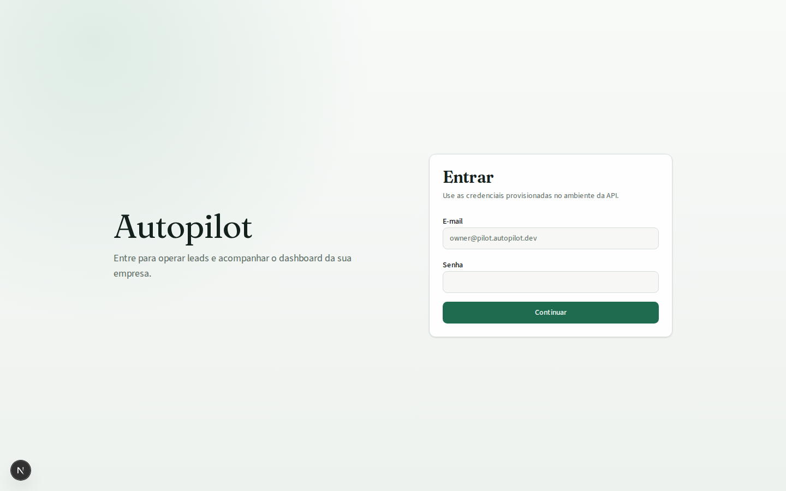

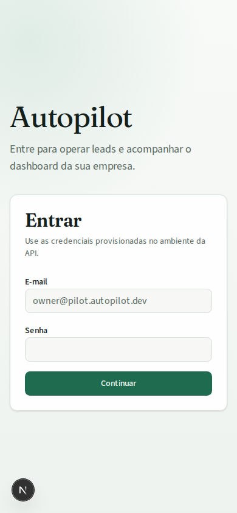

**O que a tela faz:** entrada com e-mail e senha; se houver 1 empresa, entra direto; se nenhuma, vai ao Setup; se várias, escolhe empresa.

**Componentes:** Card, Input, Label, Button, tipografia display (Fraunces).

**UX / visual:** marca forte no hero; copy ainda fala em “credenciais provisionadas na API” (tom interno). Mobile empilha marca + card corretamente.

**Inconsistências:** placeholder de e-mail usa domínio de piloto, não o seed local.

---

### 2.2 Select company — `/select-company` — **B**

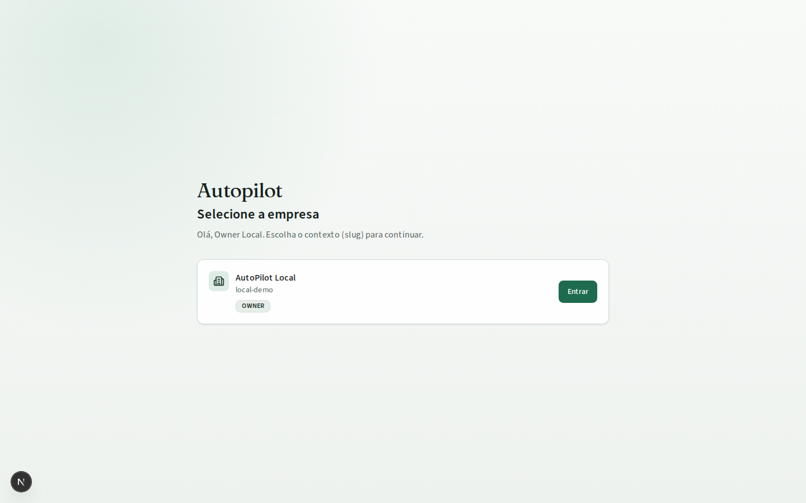

**O que faz:** lista empresas disponíveis e vincula a sessão.

**Componentes:** Card, Badge (role), Button.

**UX:** claro para multi-empresa; pouco necessário no seed (1 membership → auto-select).

---

### 2.3 Dashboard — `/dashboard` — **B**

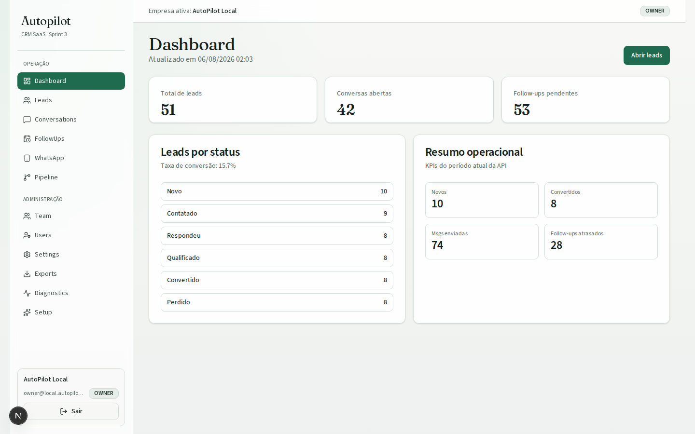

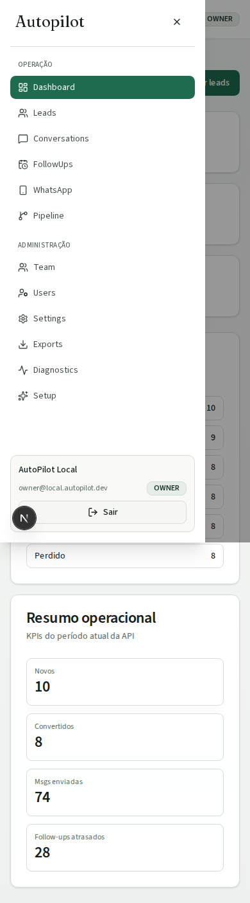


**O que faz:** KPIs reais (leads, conversas, follow-ups) e distribuição por status.

**Componentes:** AppShell, Card, Badge, Button, Skeleton.

**UX:** útil para panorama; KPIs não são clicáveis para filtrar listas. Subtítulo “KPIs do período atual da API” é técnico. Sidebar no mobile funciona (drawer).

**Inconsistências:** badge OWNER duplicado (header + rodapé); labels do menu em inglês misturados com PT (`Conversations`, `FollowUps`, `Team`).

---

### 2.4 Leads — `/leads` — **B**

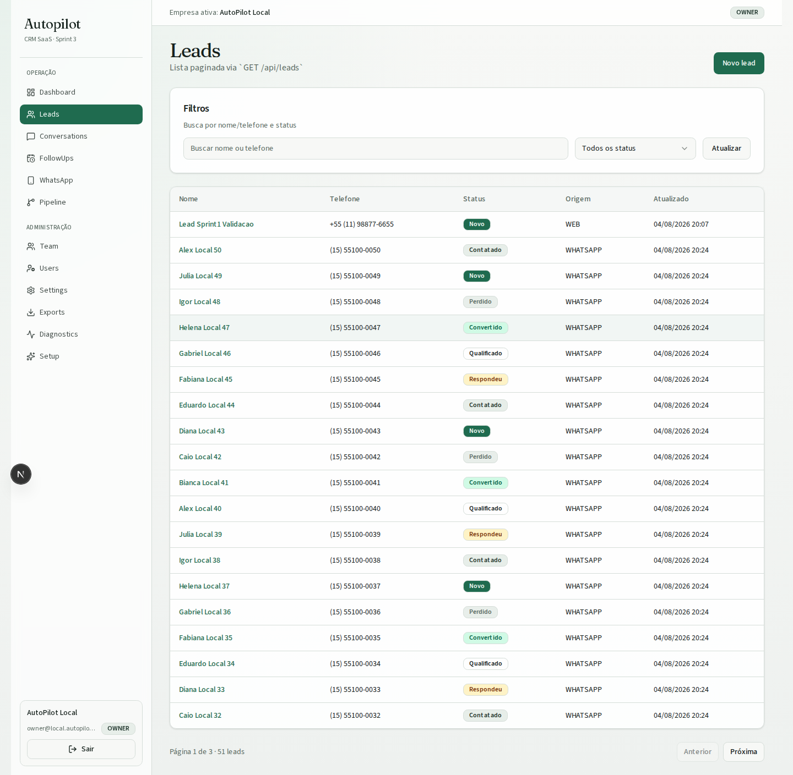

**O que faz:** buscar, filtrar por status, paginar, criar lead, abrir detalhe.

**Componentes:** Card, Input, Select, Button, table HTML, Badge, Dialog (novo lead).

**UX:** operação ok; subtítulo expõe `GET /api/leads`. Tabela densa no mobile (scroll horizontal implícito).

---

### 2.5 Lead detalhe — `/leads/[id]` — **B**

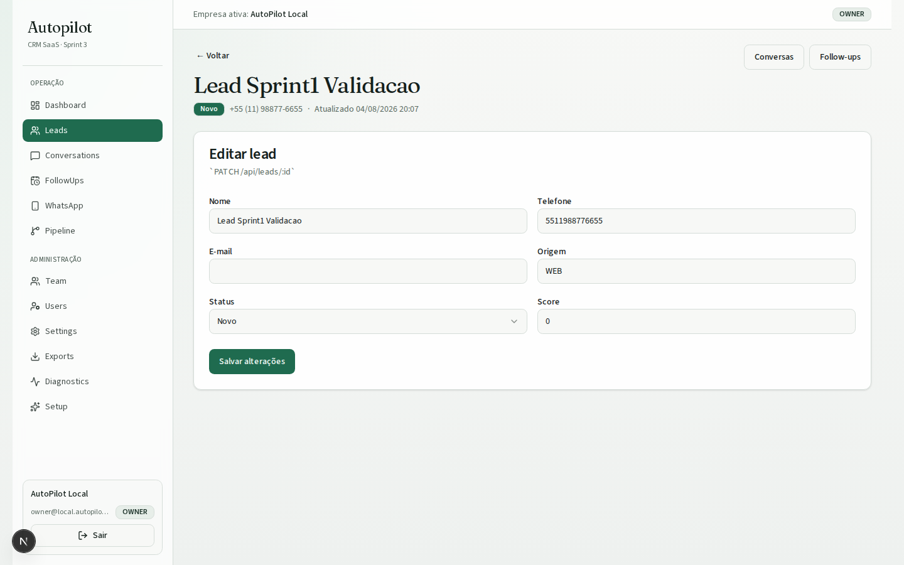

**O que faz:** editar nome, telefone, e-mail, origem, status e score.

**Componentes:** Card, form RHF+Zod, Select, Input, Badge, Button.

**Falta para CRM completo:** notas, atividades, timeline, assign/unassign (API já tem).

---

### 2.6 Conversations — `/conversations` — **B**

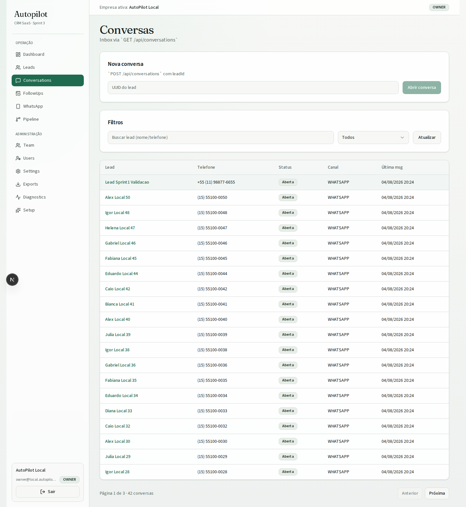

**O que faz:** inbox, filtro por status, criar conversa informando UUID do lead.

**UX:** criar conversa por UUID é pouco amigável para operação real (deveria ser picker de lead).

---

### 2.7 Conversation detalhe — `/conversations/[id]` — **B**

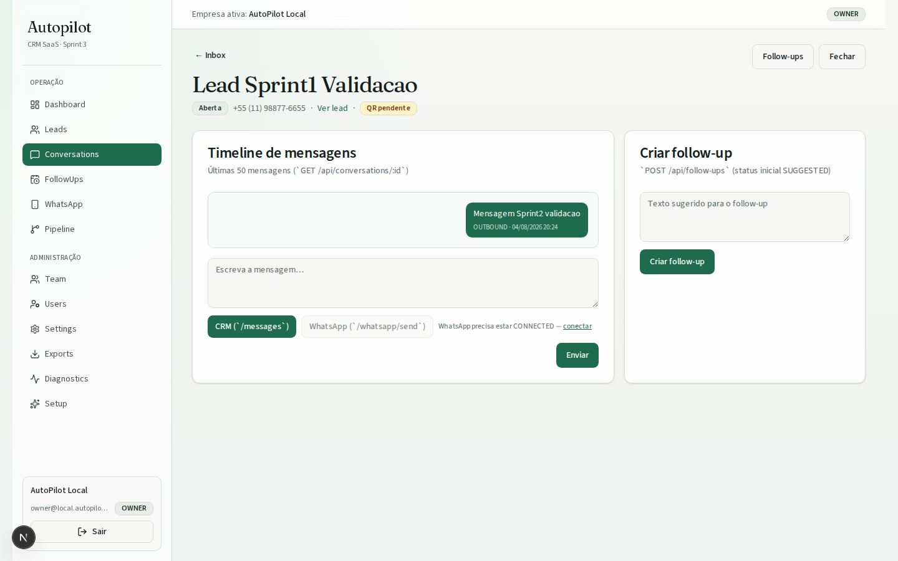

**O que faz:** timeline de mensagens, envio CRM ou WhatsApp, fechar conversa, criar follow-up sugerido.

**UX:** labels mostram rotas de API; WhatsApp bloqueado visualmente se não conectado (correto). Sem painel de IA.

---

### 2.8 Follow-ups — `/follow-ups` — **B**

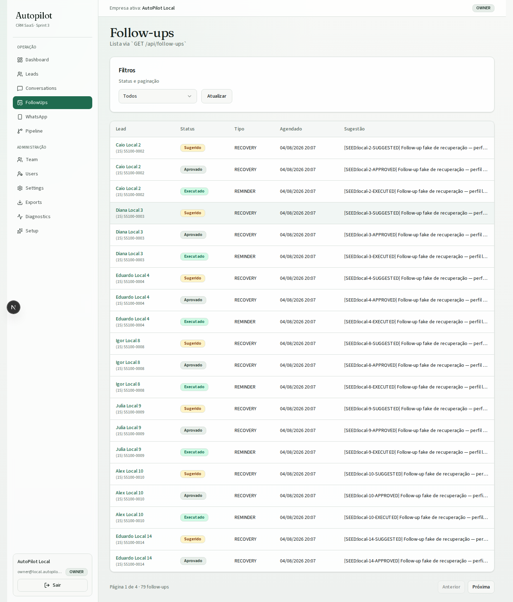

**O que faz:** lista filtrável por status; abre detalhe para aprovar/rejeitar/reagendar/executar/retry.

---

### 2.9 Follow-up detalhe — `/follow-ups/[id]` — **B**

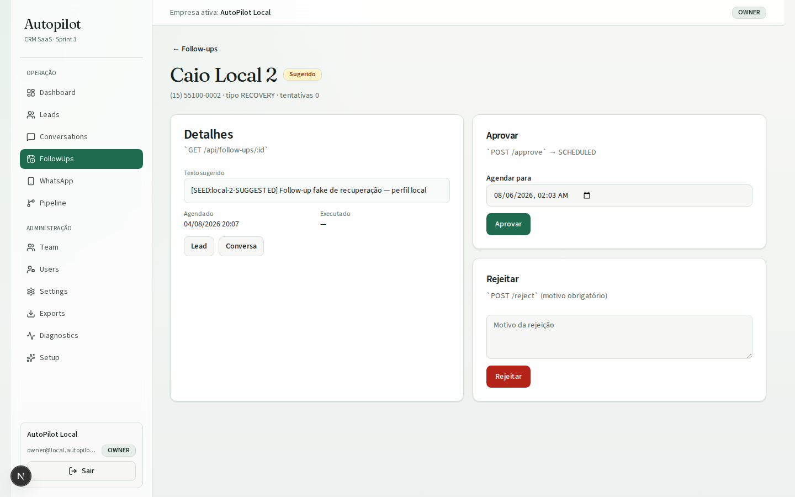

**O que faz:** ações operacionais do follow-up.

**Gap:** cancelar existe na API/client, mas sem botão evidente na UI.

---

### 2.10 WhatsApp — `/whatsapp` — **C**

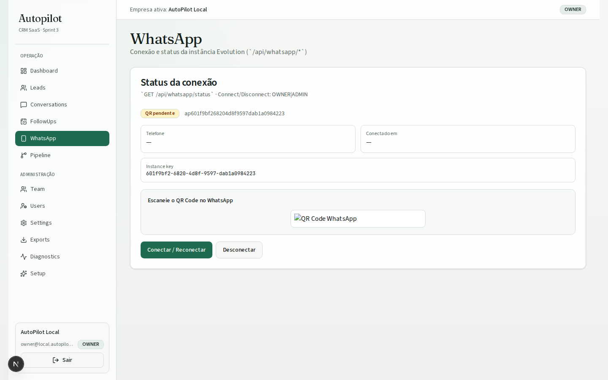

**O que faz:** ver status, conectar/desconectar, exibir QR.

**Problemas observados no ambiente:** status “QR pendente” com imagem de QR quebrada; copy técnica (“Evolution”, paths de API). Bloqueador real para piloto se a instância não conectar.

---

### 2.11 Pipeline — `/pipeline` — **B**

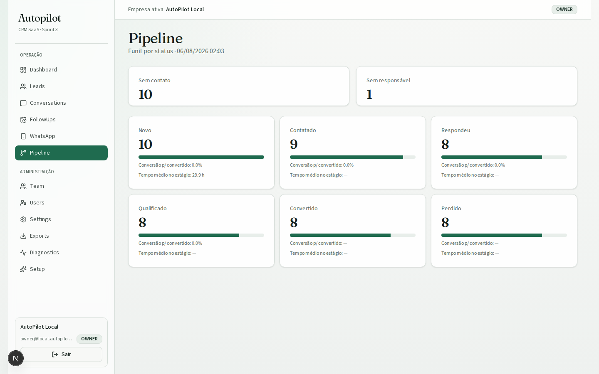

**O que faz:** funil por status + leads sem contato / sem responsável.

**UX:** é KPI de funil, não board Kanban com cards arrastáveis. Ainda assim útil.

---

### 2.12 Team — `/team` — **B → C**

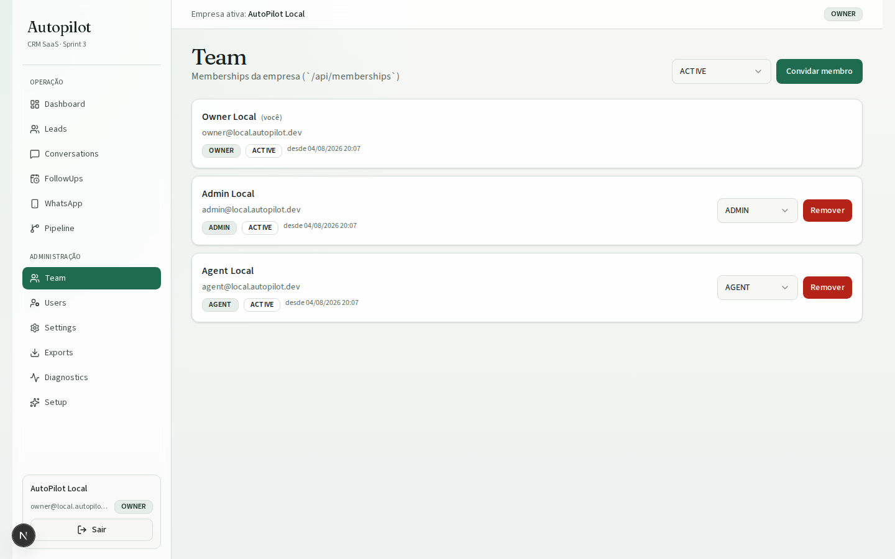

**O que faz:** listar membros, convidar, mudar role, remover.

**UX:** convite com `delivery: NONE` (sem e-mail) — precisa de copy clara para cliente. Subtítulo técnico.

---

### 2.13 Users — `/users` — **C**

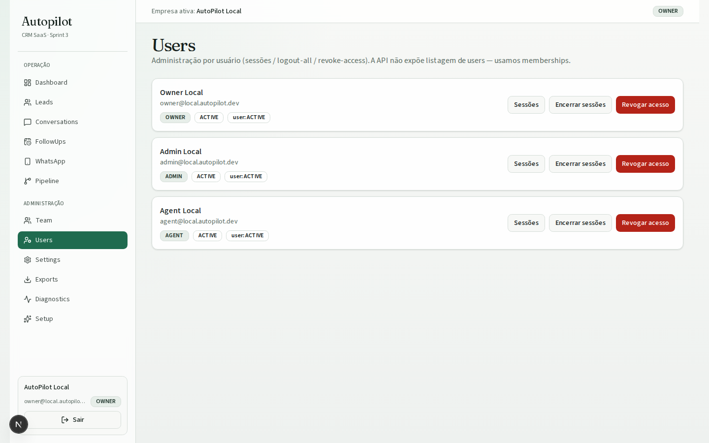

**O que faz:** a partir dos memberships, ver sessões, encerrar todas, revogar acesso.

**UX:** tela de segurança/admin; overlap com Team (mesma base de pessoas).

---

### 2.14 Settings — `/settings` — **B**

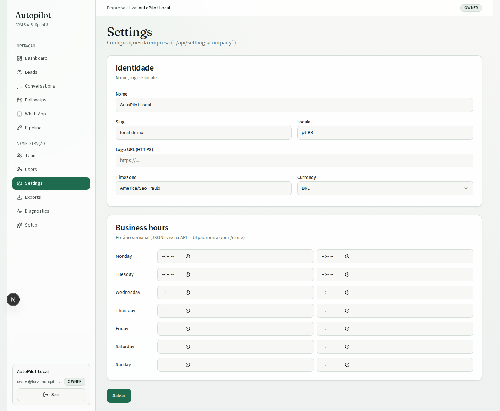

**O que faz:** nome, logo (URL HTTPS), locale, timezone, moeda, horários semanais. Slug só OWNER.

---

### 2.15 Exports — `/exports` — **B**

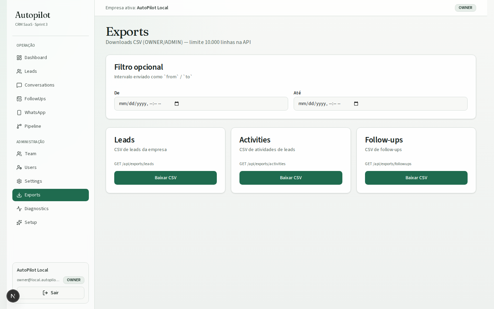

**O que faz:** baixar CSV de leads, activities e follow-ups (com intervalo opcional).

---

### 2.16 Diagnostics — `/diagnostics` — **C**

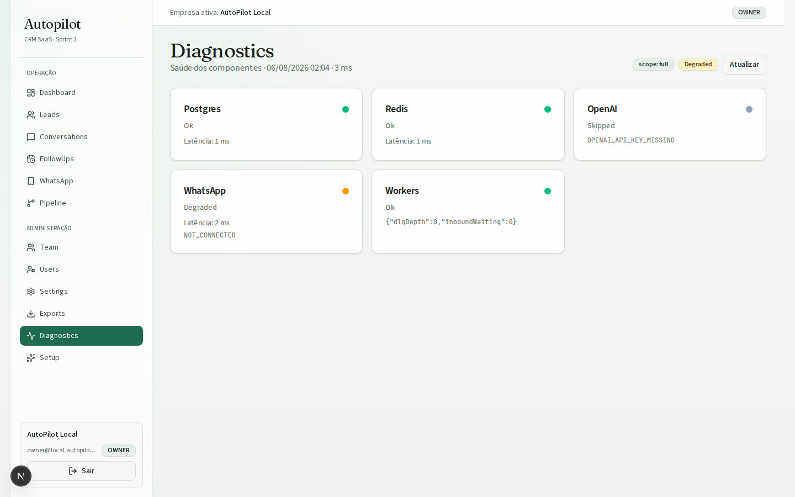

**O que faz:** saúde visual Postgres, Redis, OpenAI, WhatsApp, Workers.

**No ambiente auditado:** Postgres/Redis/Workers ok; OpenAI skipped (sem chave); WhatsApp degraded (não conectado) → status geral *degraded*.

---

### 2.17 Setup — `/setup` — **B**

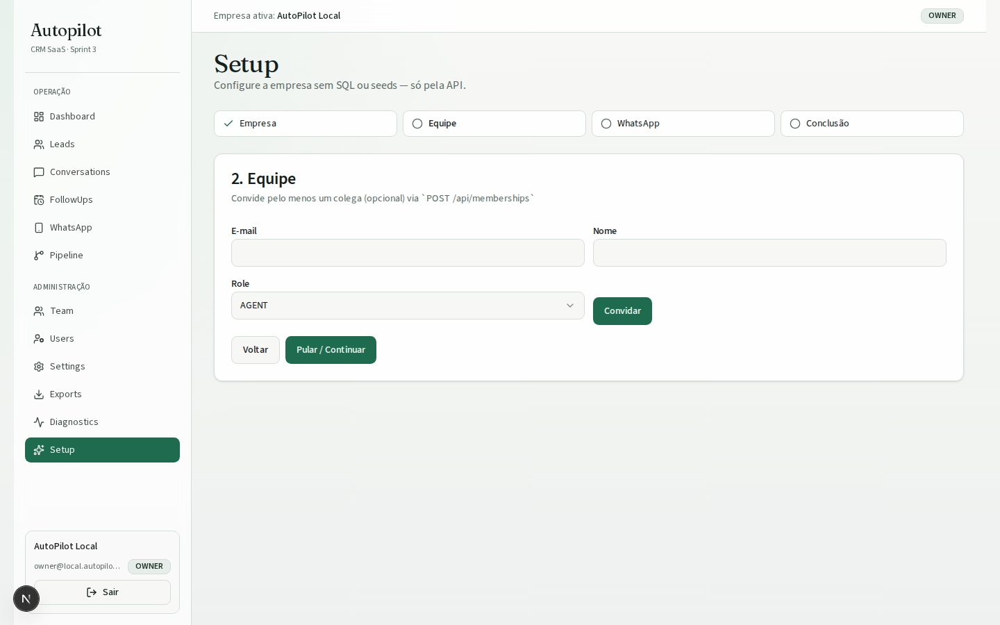

**O que faz:** wizard para empresa nova (e etapas seguintes com empresa já existente).

**UX:** essencial para “sem SQL/seed”; ainda mistura passos com referências de endpoint.

---

### 2.18 Logout — `/logout` — **A** (transitória)

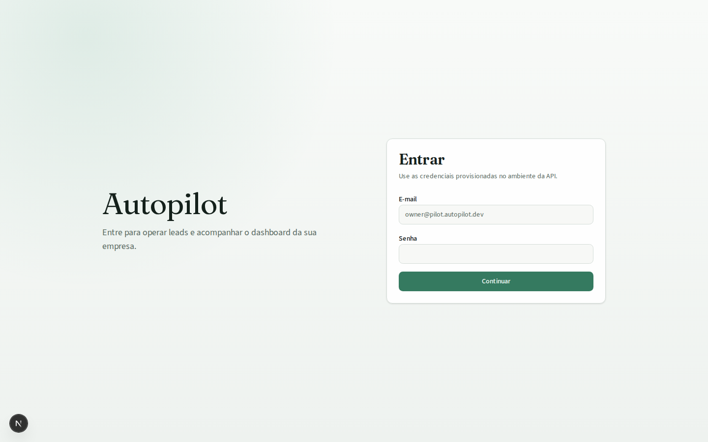

**O que faz:** encerra sessão e retorna ao login (flash “Encerrando sessão…”).

---

## 3. Fluxos possíveis para OWNER

1. **Entrar e operar** — login → (auto) empresa → dashboard → leads/conversas/follow-ups.  
2. **Onboarding do zero** — login sem empresa → Setup (criar empresa) → convidar equipe → conectar WhatsApp → dashboard.  
3. **Conectar canal** — WhatsApp → Conectar → escanear QR → status CONNECTED.  
4. **Ciclo comercial** — criar/editar lead → abrir/criar conversa → enviar mensagem (CRM ou WA) → criar follow-up → aprovar → executar.  
5. **Ver funil** — Pipeline (volumes por estágio + higiene).  
6. **Administrar time** — Team (convidar/role/remover) + Users (sessões/revogar).  
7. **Configurar empresa** — Settings (marca, locale, moeda, horários, slug).  
8. **Exportar** — CSV leads/activities/follow-ups.  
9. **Diagnosticar** — Diagnostics (infra + WA + workers + OpenAI).  
10. **Sair** — Sair / `/logout`.

---

## 4. Fluxos possíveis para ADMIN

Quase iguais ao OWNER, **exceto**:

- Não edita **slug** da empresa (config crítica).  
- Não convida role **OWNER** (só ADMIN/AGENT).  
- Pode conectar/desconectar WhatsApp, exportar, gerir time/users, ver diagnostics completos.

Tudo de operação (leads, conversas, follow-ups, pipeline) liberado.

---

## 5. Fluxos possíveis para AGENT

**Só operação:**

1. Login → empresa → Dashboard / Leads / Conversations / FollowUps / Pipeline.  
2. Ver status WhatsApp (conectar fica com OWNER/ADMIN na API).  
3. Diagnostics em escopo **limited** (sem OpenAI/Workers detalhados).  

**Não vê no menu:** Team, Users, Settings, Exports, Setup.

---

## 6. Funcionalidades na API sem UI (ainda)

| Capacidade na API | Impacto no negócio |
|-------------------|--------------------|
| Notas do lead | Histórico humano no lead |
| Atividades do lead (criar/concluir/cancelar) | Agenda operacional |
| Timeline unificada do lead | Visão 360 |
| Assign / unassign / bulk-assign | Distribuição de carteira |
| Soft delete de lead | Limpeza de base |
| Sugestão de IA na conversa | Acelerar respostas |
| Cancelar follow-up (botão) | Encerrar sugestão sem rejeitar |
| PATCH de conversa / follow-up (edição livre) | Ajustes finos |
| Ops: audit, webhooks monitor, reconcile | Operação avançada / suporte |
| `logout-all` do próprio usuário | Segurança pessoal |
| Dashboard sub-rotas (`/overview` etc.) | Já cobertas pelo `/dashboard` full |

Fora do SaaS (propositais): health, metrics Prometheus, webhook WhatsApp S2S, scaffolds vazios `companies`/`events`.

---

## 7. UI com stubs / dados simulados / vazamentos técnicos

**Não há mocks de dados no frontend** — listas e KPIs vêm da API real (seed local).

O que *parece* “interno” e prejudica percepção de produto:

| Achado | Onde |
|--------|------|
| Textos com path de API (`GET /api/...`) | Leads, Conversas, Follow-ups, WhatsApp, Team, Settings, Setup, Exports… |
| Menu em inglês + PT misturado | AppShell (`Conversations`, `FollowUps`, `Team`, `Users`…) |
| Subtítulo “CRM SaaS · Sprint 3” | Sidebar |
| Metadata “Sprint 1/2 Validacao” | Dados seed (não é stub de UI) |
| QR WhatsApp quebrado / NOT_CONNECTED | Ambiente, não mock |
| OpenAI skipped sem chave | Ambiente |
| Convite `delivery: NONE` | Limitação real da API (precisa copy de produto) |
| Criar conversa por UUID | UX crua, não stub |

---

## 8. Blockers para a primeira empresa real em operação

Ordenados por criticidade:

1. **WhatsApp conectável de ponta a ponta** — sem QR/CONNECTED estável não há outbound real.  
2. **Remover linguagem de engenharia da UI** — cliente não deve ver endpoints/Sprint N.  
3. **Onboarding de convite utilizável** — hoje o convite não envia e-mail; precisa processo manual ou entrega futura.  
4. **Lead operacional completo** — sem notes/timeline/assign o time trabalha “cego”.  
5. **Picker de lead** ao criar conversa (acabar com UUID).  
6. **Ambiente com OpenAI** se quiser IA no piloto (API existe; UI ainda não).  
7. **Hardening de sessão** — tokens em `localStorage` ok para piloto fechado; frágil para produção aberta.  
8. **Observabilidade/suporte** — Diagnostics ajuda; falta audit/reconcile na UI para suporte.  
9. **Conteúdo PT consistente** + estados vazios amigáveis.  
10. **Teste com usuário não-seed** via Setup (provar caminho sem SQL).

---

## Classificação consolidada das telas

| Tela | Nota | Motivo curto |
|------|:----:|--------------|
| Logout | **A** | Transitória, correta |
| Login | **B** | Visual ok; copy interna |
| Select company | **B** | Funcional |
| Dashboard | **B** | Dados reais; sem drill-down |
| Leads lista | **B** | Operável; vazamento técnico |
| Lead detalhe | **B** | Edita, mas incompleto vs CRM |
| Conversations | **B** | Inbox ok; create por UUID |
| Conversation detalhe | **B** | Núcleo operacional; sem IA |
| Follow-ups lista/detalhe | **B** | Ciclo principal ok |
| Pipeline | **B** | Funil útil, não board |
| Settings | **B** | Completo o suficiente |
| Exports | **B** | Simples e útil |
| Setup | **B** | Crítico para onboarding |
| Team | **C** | Admin; copy/API delivery |
| Users | **C** | Ferramenta interna de segurança |
| WhatsApp | **C** | Depende de infra; QR/status frágeis |
| Diagnostics | **C** | Ops interno |

---

## MVP atual (o que já é verdade)

Um **CRM operável em piloto fechado**, com:

- Login multi-empresa + Setup sem SQL  
- Leads (CRUD básico)  
- Conversas + mensagens  
- Follow-ups (aprovar / executar / reagendar)  
- WhatsApp connect/status (quando infra ok)  
- Pipeline KPI  
- Time, usuários, settings, exports, diagnostics  
- RBAC visual OWNER / ADMIN / AGENT  

**Não é** ainda um produto “polido de prateleira”: a UI fala a língua do time de engenharia e o canal WhatsApp/IA dependem de configuração de ambiente.

---

## O que falta para piloto pago (1ª empresa pagante, acompanhamento próximo)

Must:

1. WhatsApp estável (QR + CONNECTED + send confiável)  
2. UI sem paths de API / labels em português de negócio  
3. Lead com notes + timeline + assign  
4. Convite de time com processo claro (mesmo que manual no início)  
5. Empty states e erros amigáveis  
6. Checklist de Setup visível no dia a dia (badge)  
7. Runbook de suporte usando Diagnostics  

Should:

8. AI suggest na conversa  
9. Cancel follow-up na UI  
10. Picker de lead / busca melhor  
11. Exports a partir dos filtros da lista de leads  

---

## O que falta para produção aberta (self-serve / escala)

1. Sessão segura (HttpOnly / BFF), recuperação de senha, rate-limit UX  
2. Entrega real de convites (e-mail/magic link) e ativação de `INVITED`  
3. Billing / planos / limites  
4. Audit log e reconcile na UI para suporte L2  
5. Observabilidade, status page, alertas  
6. Onboarding self-serve completo + verificação de domínio/WhatsApp business  
7. Conformidade (LGPD: export/delete, consentimentos)  
8. Soft delete / retenção / backups testados  
9. Performance e E2E em staging  
10. Remoção total de copy de sprint/seed; design system estável (A em todas as telas de operação)

---

## Responsividade (síntese)

| Aspecto | Desktop | Mobile |
|---------|---------|--------|
| Login | Bom | Bom |
| Shell + menu | Sidebar fixa | Drawer funcional |
| Tabelas (leads/conversas) | Ok | Apertadas; precisam card/list pattern |
| Forms (settings/setup) | Ok | Ok (stack) |
| Conversation 2 colunas | Ok | Empilha; usable |
| Labels longos de API | Poluem ambos | Pior no mobile |

---

## Oportunidades de melhoria (priorizadas)

1. **Produto:** trocar todos os subtítulos técnicos por linguagem de negócio.  
2. **Canal:** tornar WhatsApp o “passo zero” verde no Setup (bloqueante visual até CONNECTED).  
3. **CRM:** tabs Notes / Timeline / Activities no lead.  
4. **IA:** botão “Sugerir resposta” na conversa.  
5. **Nav:** português consistente + ícones distintos Team vs Leads.  
6. **Mobile:** listas em cards; menos colunas.  
7. **Confiança:** remover “Sprint 3” do chrome do app.  
8. **Team/Users:** unificar em “Equipe” com abas Membros | Segurança.

---

## Como as capturas foram geradas

Script: `scripts/capture-ui-showcase.mjs` (Playwright), usuário OWNER seed, API local populada.

```bash
cd apps/web && PORT=3000 npm run dev   # API em :3001
cd scripts && npm i && npx playwright install chromium
node capture-ui-showcase.mjs
```

Arquivos em `docs/ui-showcase/screenshots/*-{desktop,mobile}.png`.

---

**Veredito:** o Autopilot web, pós Sprint 3 + PR #51, é um **MVP operacional de piloto assistido**. Serve para demonstrar e operar com acompanhamento; **ainda não** está no padrão visual/UX de piloto pago autônomo nem de produção aberta.
